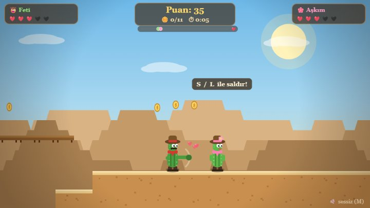

# 🌵 Kaktüs Sevgililer — Çöl Macerası

İki kişilik, tek klavyede oynanan vahşi batı temalı bir co-op platform oyunu.
Sevgilinizle birlikte çölü aşın, akrepleri yumruklayın, altınları toplayın ve
**bayrağa ikiniz birden ulaşın!** 💕

🕹 **Hemen oyna:** https://fetiicolak.github.io/kaktus-sevgililer/

## 🎮 Nasıl Oynanır?

Yukarıdaki linkten tarayıcıda oynayın ya da `index.html` dosyasını indirip açın — kurulum, ek dosya gerekmez.

**📱 Mobil & tablet desteği:** Dokunmatik cihazlarda ekran köşelerinde kontroller belirir — sol köşe 1. oyuncu, sağ köşe 2. oyuncu. Telefonu yatay tutun, tam ekran düğmesine (⛶) dokunun ve bir tablette yan yana oturup birlikte oynayın!

| | 🤠 1. Oyuncu | 🌸 2. Oyuncu |
|---|---|---|
| Hareket | `A` `D` | `◀` `▶` |
| Zıpla | `W` | `▲` |
| Saldır | `S` | `L` veya Sağ `Shift` |

`P` duraklat · `M` ses aç/kapat

## ✨ Özellikler

- **Gerçek co-op:** Bölümü bitirmek için ikinizin de bayrağa ulaşması gerekir; kamera ikinizi birden ekranda tutar.
- **Canlandırma mekaniği:** Canı biten oyuncu yere serilir — partneri yanında durup onu hayata döndürür. 💚 İkiniz birden düşerseniz bölüm baştan!
- **3 bölüm, 3 atmosfer:** Gündüz çölü → günbatımı kanyonu → yıldızlı gece. Her bölümün kendi ışığı, gökyüzü ve ortamı var.
- **Düşmanlar ve tehlikeler:** Devriye gezen akrepler, uçan akbabalar, dikenler ve çukurlar. Yumrukla ya da üstlerine zıplayarak ez!
- **Toplanacaklar:** Altınlar (mıknatıs gibi size çekilir), +1 can veren kalpler, kontrol noktaları.
- **Western fon müziği** ve tüm ses efektleri WebAudio ile kodda üretilir — hiç ses dosyası yok.
- **Kişiselleştirme:** Başlangıç ekranında kendi isimlerinizi yazın, oyun boyunca ekranda görünsün.
- Paralaks arka planlar, gölgeler, parçacık efektleri, vuruş anı yavaşlatması, yakınlık kalpleri 💞 ve daha fazlası.

## 🛠 Teknik

- Tek dosya: saf HTML + CSS + JavaScript (Canvas 2D), harici bağımlılık yok.
- Kare hızından bağımsız fizik (delta-time), coyote time + jump buffering.
- Bölümler ASCII harita olarak tanımlı — yeni bölüm eklemek çok kolay.

---

*Sevgililer için sevgiyle yapıldı 💕*
